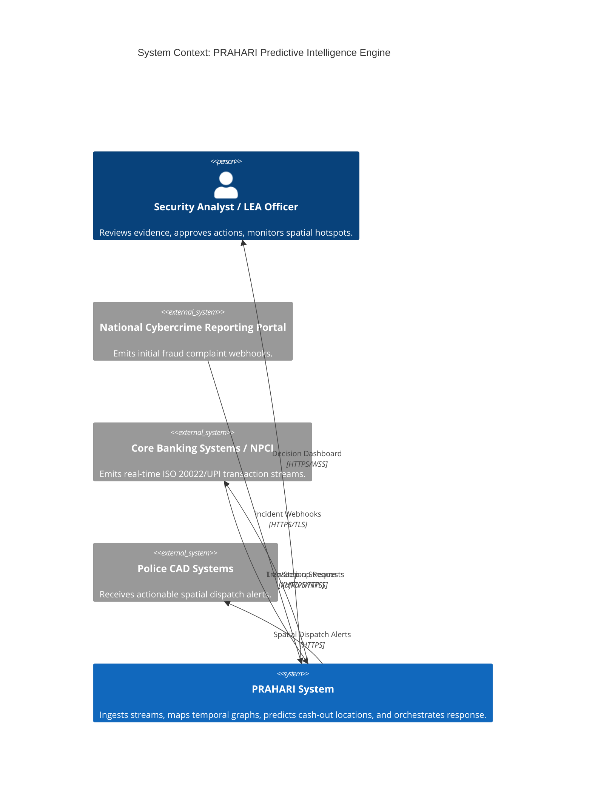
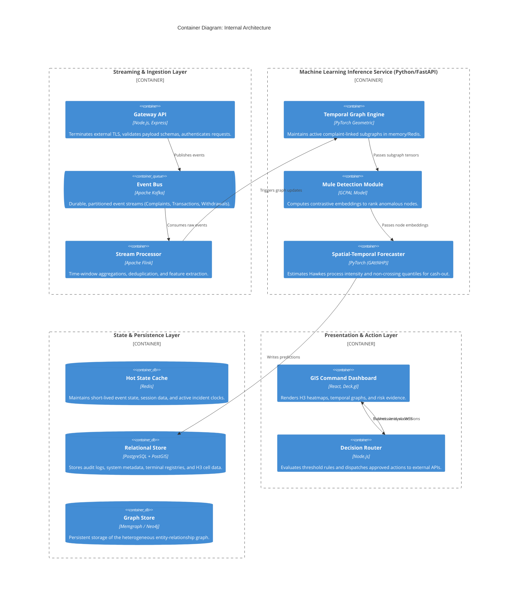

# PRAHARI Engineering Architecture

This document provides a fine-grained, professional engineering breakdown of the PRAHARI system architecture. The architecture is designed for high-throughput stream processing, complex temporal graph inference, and secure, privacy-preserving multi-institutional collaboration.

## 1. System Context Topology

At the highest level, PRAHARI operates as a secure intermediary layer between national reporting portals (NCRP), core banking systems (CBS), and law enforcement agency (LEA) dispatch systems.

## 2. Fine-Grained Component Architecture

The system is strictly decoupled into ingestion, intelligence, decision, and presentation layers to allow independent scaling of I/O-bound stream processors and compute-bound ML inference engines.

## 3. Machine Learning Subsystem Data Flow

The ML service is the core of PRAHARI, operating on a continuous feedback loop:

1.  **Graph Construction:** Incoming transactions update a heterogeneous graph (Nodes: Accounts, Devices, Terminals; Edges: Transfers, Shared Attributes). Time-stamps are strictly preserved to maintain temporal causality.
2.  **Structural Pre-training (GCPAL):** To overcome the deficit of labeled data for newly activated mule accounts, the system applies Graph Contrastive Pre-training. It creates structurally and temporally perturbed views of the subgraph, optimizing a contrastive loss function to ensure robust node embeddings.
3.  **Intensity Estimation (GAttNHP):** The Group Attention Neural Hawkes Process module treats cash withdrawals as a self-exciting point process. A rapid fan-out of funds dynamically spikes the baseline spatial intensity $\mu_k(x)$ across nearby H3 cells.
4.  **Quantile Regression:** Instead of providing a brittle point-in-time estimate, the model outputs Non-Crossing Quantiles (e.g., $q_{10}, q_{50}, q_{90}$) to define a calibrated time-to-withdrawal probability interval.

## 4. Spatial Indexing Strategy

To abstract raw latitude/longitude coordinates into operationally viable dispatch zones, PRAHARI relies on the Uber H3 geospatial indexing system.
*   **Resolution Selection:** The system maps terminal coordinates to H3 Resolution 8 (avg. edge length ~531m) or Resolution 9 (~201m) cells.
*   **Aggregation:** Prediction intensities are aggregated at the cell level. This prevents over-alerting on individual ATMs and instead directs law enforcement to high-probability *clusters*.

## 5. Security and Privacy Architecture

Financial transaction networks span strict regulatory boundaries. PRAHARI incorporates a privacy-first engineering roadmap:
*   **Pseudonymization:** All account identifiers (PII) are cryptographically hashed (salted) before entering the ML pipeline.
*   **Federated Learning:** To construct a robust national model without pooling raw bank ledgers, PRAHARI supports a decentralized training paradigm. Institutions train local models and communicate only gradient updates.
*   **Secure Aggregation & Differential Privacy:** Gradient updates are subjected to L2-norm clipping and Gaussian noise injection before being aggregated by the central coordinator, mitigating membership inference attacks.
*   **Auditability:** Every system-generated forecast, analyst approval, and automated API dispatch is logged immutably in PostgreSQL to ensure full traceability and accountability.

## 6. Latency and Scalability Considerations

*   **Complaint-Linked Subgraphs:** Executing deep graph neural networks across a national-scale transaction graph in real-time is computationally prohibitive. PRAHARI relies on localized graph traversal; the temporal graph is expanded iteratively starting *only* from the nodes linked to the specific NCRP incident webhook.
*   **Asynchronous Processing:** Inference tasks are decoupled from ingestion via Kafka. The Gateway API will never block waiting for a Hawkes process calculation.
*   **Read-Optimized Views:** The PostgreSQL database utilizes materialized views and spatial indexes (PostGIS/H3) to ensure sub-second rendering of GIS heatmaps on the React frontend.
