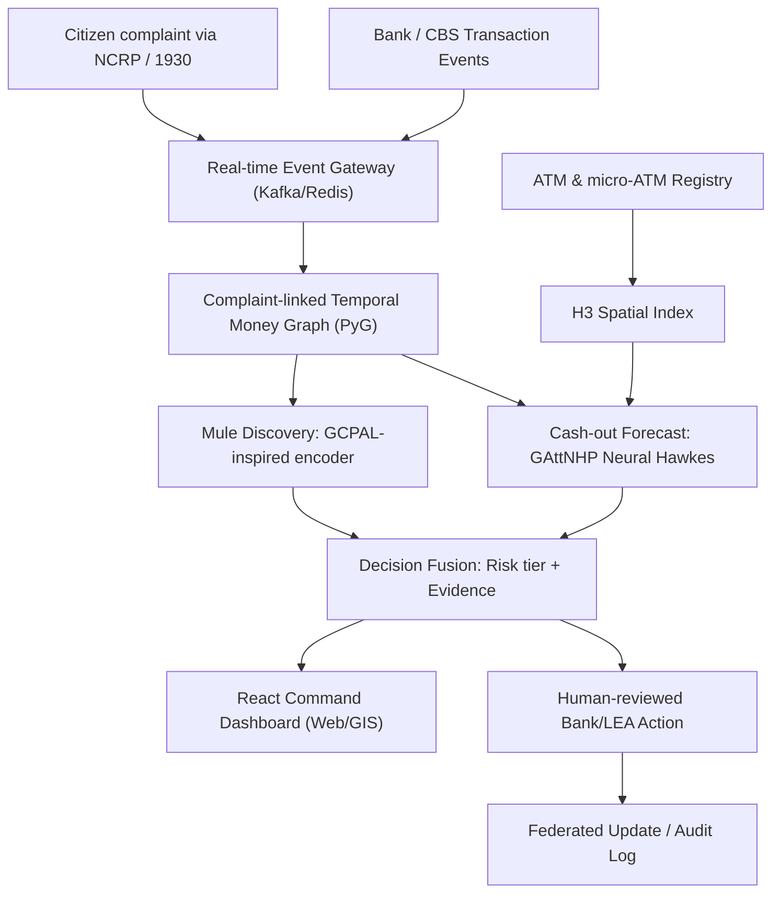

# PRAHARI System Architecture

This document details the architectural design of PRAHARI, an end-to-end predictive cybercrime response system.

## 1. End-to-End Operational Workflow

## 2. Core System Layers

1. **Input Layer:** Ingests NCRP complaint webhooks, ISO 20022/UPI transaction streams, and I4C suspect-registry signals.
2. **Streaming Layer:** Built on Apache Kafka / Apache Flink / Redis for event ingestion, validation, and real-time state management.
3. **Intelligence Layer:** 
   - **Heterogeneous Temporal Graph:** Uses PyTorch Geometric to map accounts, VPAs, devices, transactions, and terminals.
   - **Mule Detection:** Graph Contrastive Pre-training for Anti-Money Laundering (GCPAL) helps identify unknown mule nodes.
   - **Forecasting:** Group Attention Neural Hawkes Process (GAttNHP) estimates the changing likelihood of cash-out at spatial terminals.
4. **Spatial Layer:** Converts terminal coordinates into high-resolution geographic cells using Uber H3 (Resolution 8/9).
5. **Decision & Action Layer:** Thresholding, confidence calibration, evidence generation, and integration with CBS webhooks or Police CAD alerts.

## 3. Technology Stack

- **Data Streaming:** Apache Kafka, Apache Flink, Redis Streams
- **Graph Storage & ML:** PyTorch Geometric (PyG), DGL, Memgraph
- **Forecasting:** PyTorch (Neural Hawkes Process, Non-crossing Quantile Regression)
- **Backend / API:** Python (FastAPI), Node.js (Express)
- **Frontend / Dashboard:** React.js, Deck.gl, Mapbox GL for H3 spatial mapping
- **Database:** PostgreSQL (with PostGIS for spatial queries)
- **Federated Privacy:** Flower (or similar federated framework for bank collaboration)

## 4. Key Mathematical Formulations

- **GCPAL Contrastive Loss:** Pre-trains graph encoders using structurally and temporally perturbed graph views.
- **Continuous-time Spatial Intensity:** Uses Hawkes processes to model withdrawals as events whose probability dynamically increases following rapid multi-hop transfers.
- **Differentially Private Updates:** Applies gradient clipping and noise to enable federated learning across different financial institutions securely.
