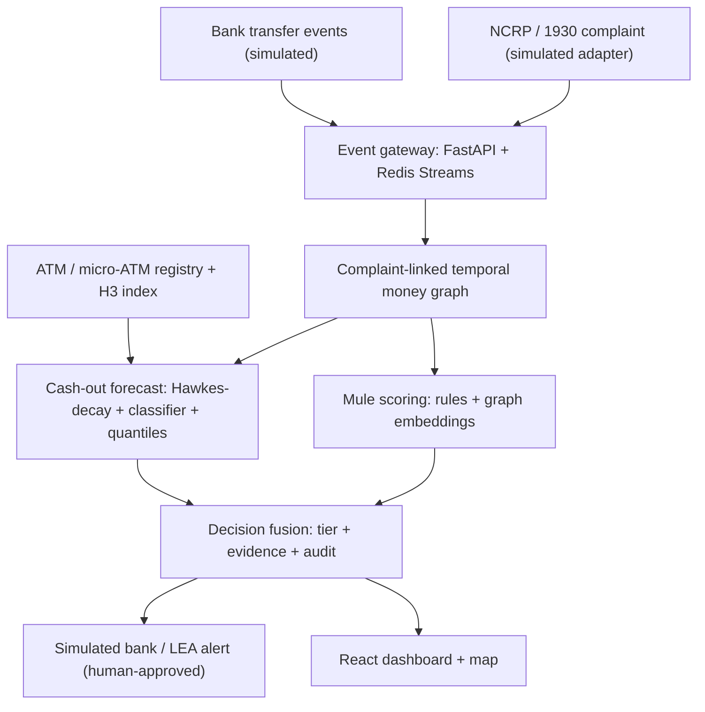

# PRAHARI

## Complaint-Anchored Predictive Analytics for Cybercrime Cash-Withdrawal Forecasting

**Smart India Hackathon 2026**
**Problem Statement:** Development of a Predictive Analytics Framework for Cybercrime Complaints to Forecast Likely Cash Withdrawal Locations in Advance, Enabling Generation of Actionable Intelligence for Timely and Proactive Cybercrime Intervention.
**Problem Statement ID:** 26184 (fill from SIH portal before submission)
**Team ID / Team Name:** (fill from SIH portal)

> **One-line pitch:** PRAHARI starts a clock at the moment a complaint is filed, traces the live money path, and turns it into an explainable prediction of *where the cash-out is likely, when it is likely, and why the team should act now*.

---

## 1. What the PS Actually Asks For

| PS keyword | What we must deliver |
|---|---|
| **Predictive Analytics Framework** | A replayable pipeline: complaint event → live graph → risk forecast, not a one-off classifier |
| **from Cybercrime Complaints** | Every prediction is anchored to `t0 = complaint time`. No complaint, no forecast |
| **Forecast Likely Cash Withdrawal Locations in Advance** | Ranked H3 cells with nearby ATM / micro-ATM / POS points, predicted *before* withdrawal |
| **Actionable Intelligence** | Not just `fraud = 0.91`. A decision object: path + location + time window + evidence + recommended review step |
| **Timely and Proactive Intervention** | Complaint-to-alert in seconds, human-reviewed tiers, simulated bank / LEA handoff |

PRAHARI answers four questions per incident:

1. **Which path?** — victim → Layer-1 → Layer-2/N accounts linked to this complaint
2. **Who is suspicious?** — mule-like nodes, including first-seen accounts
3. **Where?** — top-K H3 cells containing likely cash-out points
4. **When + what action?** — time window (e.g. 15–45 min) + Green / Amber / Red tier

Example output:

```json
{
  "incident_id": "INC-2026-00041",
  "complaint_clock_minutes": 6,
  "risk_tier": "RED",
  "money_path": ["victim_hash", "acct_17", "acct_31", "acct_44"],
  "suspected_nodes": ["acct_31", "acct_44"],
  "probable_cashout_cells": [
    {"h3_cell": "8928308280fffff", "probability": 0.78, "nearby_cashout_points": 4}
  ],
  "cashout_window_minutes": {"q10": 15, "median": 27, "q90": 45},
  "evidence": [
    "rapid fan-out within 5 min of complaint-linked receipt",
    "newly active intermediary with no prior history",
    "path converging near 4-terminal cluster"
  ],
  "recommended_action": "analyst_review_and_simulated_bank_step_up",
  "model_version": "prahari-0.1",
  "human_review_required": true
}
```

---

## 2. Why PRAHARI Is Different (Lean Uniqueness)

We deliberately use **fewer components**. Four modules, one loop:

```text
complaint event
  → complaint-linked temporal graph (only this incident's subgraph)
  → mule scoring (rules + embeddings)
  → recency-decayed cash-out forecast over H3 cells
  → tiered, explainable, human-reviewed alert
```

The unique idea is the **complaint clock**:

* All features are computed relative to `t0` (complaint time), not wall-clock time.
* Recent transfers excite near-term cash-out risk; the effect decays as minutes pass.
* If no new events arrive, risk decays instead of staying frozen.
* If a new hop appears, the forecast updates in seconds.

This is what makes PRAHARI proactive rather than a static hotspot map or a single-account fraud score. We do not claim to have invented graph learning, Hawkes processes, federated learning, or H3. The contribution is the **complaint-triggered fusion + calibration + operational handoff** for this PS.

What we intentionally cut for hackathon viability:

| Cut / simplified | Why |
|---|---|
| No Kafka / Flink in prototype — use Redis Streams + FastAPI event gateway | Same replayable stream semantics, 10x less ops burden |
| No full HTGT transformer — use GraphSAGE / GAT with temporal edge features | Trains in minutes on synthetic data, explainable |
| No full GAttNHP — use Hawkes-decay features + XGBoost + quantile head (NHP-inspired) | Captures recency + excitation intuition without weeks of tuning |
| No HE / SMPC in prototype — FedAvg demo across 2–3 simulated banks | Proves privacy boundary; HE/SMPC stay on production roadmap |
| One spatial resolution default (H3 res 8), configurable | Avoids false "100 m" claims; res 8 ≈ 460 m edge avg, res 9 ≈ 170 m edge avg (varies by latitude) |

---

## 3. System Flow



**Demo story (replayable in < 3 minutes):**

1. `10:00` — complaint filed via mock NCRP adapter, clock starts.
2. `10:01` — funds hit Layer-1 account.
3. `10:03` — amount splits across two Layer-2 accounts.
4. `10:06` — one new node moves toward a 4-terminal H3 cluster.
5. Dashboard updates: path highlights, cell `892830...` jumps to p=0.78, window `15 / 27 / 45 min`.
6. Analyst acknowledges → simulated bank step-up → outcome logged as blocked / missed.

---

## 4. The Four Modules (Only What We Build)

### Module 1 — Complaint intake + event stream

* `POST /api/incidents` creates incident with `t0`, amount, source hash, channel.
* `POST /api/events/transactions` and `POST /api/events/withdrawals` normalise to one schema: `{event_id, incident_id, ts, src, dst, amount, channel, bank, device_hash?, terminal_id?}`.
* Redis Streams holds recent events; a small generator replays normal traffic + fraud paths + delayed / missing events for robustness tests.
* All identifiers are hashed / tokenised in the prototype. Raw PII never appears on the dashboard.

### Module 2 — Complaint-linked temporal money graph

* Nodes: accounts, complaint, bank/channel, device/phone hash, terminal.
* Edges: timestamped transfers, withdrawals, shared-attribute links.
* Only the k-hop subgraph around the complaint is scored — this keeps latency low at national scale.
* Encoder: GraphSAGE or GAT with edge features `[log_amount, dt_since_t0, channel_onehot, velocity]`. HTGT-style full attention is a roadmap ablation, not the default.
* Output: node embeddings + path from victim to frontier nodes.

### Module 3 — Mule scoring (explainable first, learned second)

Baseline score (always shown, fully explainable):

```text
mule_score = w1*fan_out_velocity + w2*fan_in_velocity
           + w3*new_account_flag + w4*hop_depth
           + w5*amount_split_ratio + w6*terminal_convergence
```

Learned add-on (GCPAL-inspired, not a reimplementation claim):

1. Two augmented views of the incident subgraph (edge dropout, feature mask).
2. Contrastive pre-training on unlabeled events so new mules get stable embeddings.
3. Fine-tune / rank with weak labels (rapid fan-out, confirmed synthetic paths).
4. Final score = calibrated blend of baseline + embedding anomaly. Dashboard shows both.

### Module 4 — Where + When forecast (Hawkes-inspired, not Hawkes-full)

For each candidate H3 cell `c` at time `t`:

```text
risk(c, t) = base_demand(c, dow, hour)
           + sum over recent transfers i [ w_i * spatial_kernel(c, c_i) * exp(-beta * (t - t_i)) ]
           + graph_context_score(incident_subgraph)
```

* `base_demand` — normal ATM-cluster activity (lightweight historical prior by cell, day-of-week, and hour to suppress false positives on busy terminals).
* `spatial_kernel` — Gaussian falloff with distance between cells.
* `exp(-beta*dt)` — recency decay; the core Hawkes intuition.
* `graph_context_score` — XGBoost on incident features + node embeddings, outputting `P(cash-out in cell c | history)`.

Time window: quantile regression head predicting `q10 ≤ q50 ≤ q90` minutes-to-cash-out with non-crossing penalty. We report intervals, never a single brittle timestamp.

Decision fusion:

```text
final = calibrated_graph_risk + cashout_intensity + velocity_bonus - uncertainty_penalty
Green (<0.35): monitor | Amber (0.35-0.65): analyst task | Red (>0.65): bank/LEA alert | Critical: active withdrawal signal
```

Every alert carries: path, cell, window, confidence, evidence bullets, model version, reviewer decision, audit ID.

---

## 5. Math (Minimal, Demo-Friendly)

**Hawkes-lite intensity** for cell `c`, terminal type `k`:

```text
lambda_k(t, c | H_t) = softplus(
  mu_k(c) + sum_{i: t_i < t} alpha * k_spatial(c - c_i) * exp(-beta*(t - t_i))
  + w . h_history(t)
)
k_spatial(d) = 1/(2*pi*sigma^2) * exp(-||d||^2 / (2*sigma^2))
```

**Quantile loss** with non-crossing penalty (for q in {0.1, 0.5, 0.9}):

```text
L = mean_q [ max(q*(y - qhat), (q-1)*(y - qhat)) ] + lambda * mean[ ReLU(q10 - q50) + ReLU(q50 - q90) ]
```

**Contrastive loss** (mule pre-training):

```text
L = -log( exp(sim(h_u1, h_u2)/tau) / sum_v exp(sim(h_u1, h_v2)/tau) )
```

---

## 6. Tech Stack (Lean)

| Layer | Choice | Why |
|---|---|---|
| Dashboard | React + Leaflet / MapLibre | Heatmap + graph + evidence panel, no Mapbox token needed |
| Gateway | Node.js + Express or FastAPI only | One gateway is enough for prototype; pick the team's stronger stack |
| ML service | Python + FastAPI, PyTorch + PyG, XGBoost, scikit-learn | Graph + classifier + quantiles, all trainable on laptop |
| Stream / state | Redis Streams + Redis cache | Replayable, low-ops; Kafka is production roadmap |
| Store | PostgreSQL (single choice) | Incidents, audit, metrics, terminal registry; supports JSON |
| Spatial | h3-py + GeoPandas | Cell assignment, neighbour aggregation |
| Federated demo | Flower or custom FedAvg across 2–3 simulated banks | Proves boundary without centralising ledgers |
| Deploy | Docker Compose | One-command demo: gateway + ml + redis + postgres + frontend |

> Resolve the old deck inconsistency: use **PostgreSQL only**. Do not show MySQL and PostgreSQL together.

---

## 7. What We Build for SIH (MVP Checklist)

1. Scenario generator (normal + fraud paths with ground truth).
2. Complaint intake API + event gateway.
3. Live graph view per incident.
4. Mule-risk engine (rules + embeddings, both visible).
5. Forecast service (ranked cells + q10/median/q90).
6. H3 map with terminal clusters + confidence.
7. Alert service with Green / Amber / Red / Critical.
8. Human-review actions: acknowledge / escalate / dismiss + reason.
9. Audit log: inputs, model version, prediction, decision, simulated action.
10. FedAvg demo (2–3 bank clients, no raw-table sharing).
11. Evaluation panel: latency, precision@K (nodes + cells), interval coverage, false positives, simulated recovery.

API surface:

```text
POST /api/incidents
POST /api/events/transactions
POST /api/events/withdrawals
GET  /api/incidents/:id/graph
GET  /api/incidents/:id/forecast
GET  /api/incidents/:id/alerts
POST /api/alerts/:id/acknowledge
POST /api/alerts/:id/escalate
POST /api/actions/simulate
GET  /api/metrics
```

Repo:

```text
prahari/
├── frontend/          # React dashboard + map
├── gateway/           # API, auth, WebSocket/SSE
├── stream-simulator/  # synthetic NCRP / bank / ATM producer
├── ml-service/        # FastAPI: graph / mule / forecast / calibration
├── data/              # schemas + small synthetic fixtures
├── infra/             # Docker Compose
└── docs/              # model card, API contract, threat model
```

---

## 8. Data + Labels (No Leakage)

* Prototype uses **synthetic transactions clearly labelled SIMULATION** + OSM-derived terminal coordinates. No live NCRP / CBS / NPCI connection is claimed.
* Supervision: strong labels (synthetic fraud paths) + weak labels (rapid fan-out, new-node rules) + unlabeled events (contrastive pre-training).
* Splits are **time-ordered**. Features at time `t` never use events after `t`. `eventually_withdrawn` is a label, not an input.

---

## 9. Evaluation (Measure, Don't Claim)

| Metric | Definition |
|---|---|
| Alert latency | complaint ingestion → first actionable alert |
| Precision@K (nodes) | top-K accounts on true fraud path |
| Precision@K (cells) | top-K cells containing true cash-out |
| Interval coverage | % true cash-outs inside [q10, q90] |
| Median time error | \|predicted median − actual\| minutes |
| False-positive rate | normal incidents escalated to Red |
| Simulated recovery rate | fraction blocked before simulated withdrawal |
| p95 system latency | graph update + forecast |

Ablation (minimum for credibility):

1. rules only → 2. tabular without graph → 3. graph without temporal decay → 4. graph + point estimate → 5. full PRAHARI (graph + decay + quantiles).

Report design targets separately from measured pilot numbers. Never present unmeasured targets as results.

---

## 10. Research Grounding (Honest)

| Reference | Role in PRAHARI |
|---|---|
| Neural Hawkes Process — Mei & Eisner, NeurIPS 2017 | Continuous-time intensity intuition for Module 4 |
| Self-Exciting Point Process Modeling of Crime — Mohler et al., JASA 2011 | Spatio-temporal clustering prior for cash-out pressure |
| GCPAL — Lu & Wang, 2024 | Contrastive pre-training intuition for Module 3 (adaptation, not invention) |
| Temporal Graph Networks — Rossi et al., 2020 | Event-based graph memory for Module 2 |
| CARE-GNN — Dou et al., CIKM 2020 | Robustness to camouflaged fraudsters |
| FedAvg — McMahan et al., AISTATS 2017 | Federated demo foundation |
| GAttNHP preprint (2026) | Advanced roadmap (group attention + non-crossing quantiles); prototype implements a simpler version |
| H3 docs + cell statistics | Spatial indexing; res 8/9 sizes reported honestly |
| GNNExplainer — Ying et al., NeurIPS 2019 | Evidence direction for dashboard |

> Say: "PRAHARI adapts temporal graph reasoning, self-supervised mule discovery, recency-decayed forecasting, and H3 action cells into one complaint-driven loop." Do not say: "We invented GCPAL / Hawkes / H3 / federated learning."

---

## 11. Risks + Safeguards

* **No live data access** → simulated adapters, clearly labelled.
* **Label scarcity** → self-supervised + weak labels + analyst feedback.
* **Cross-bank boundary** → FedAvg demo; DP / secure aggregation on roadmap, not claimed as done unless benchmarked.
* **False positives** → calibrated tiers, evidence display, mandatory human approval, reversible simulated actions only.
* **Drift** → red-team scenarios + recalibration + drift metric.
* **H3 misuse** → resolution configurable, actual cell stats reported.
* **Security** → hashed IDs, RBAC, HTTPS, audit trail, model version on every alert.

---

## 12. Presentation Narrative (8 slides)

1. Money moves before response catches up.
2. PRAHARI starts from the complaint and starts the clock.
3. Live graph reveals the active path, including new mules.
4. Recency-decayed forecast predicts the next cash-out window.
5. H3 turns it into a precise ATM-cluster action area.
6. Banks improve together without pooling ledgers (FedAvg demo).
7. Human-reviewed tiers make it accountable.
8. Replayable synthetic scenario proves the loop end-to-end.

> Closing: "PRAHARI does not wait for the withdrawal to become evidence. It turns the first complaint into a live prediction of the next cash-out — where, when, and why to act."
