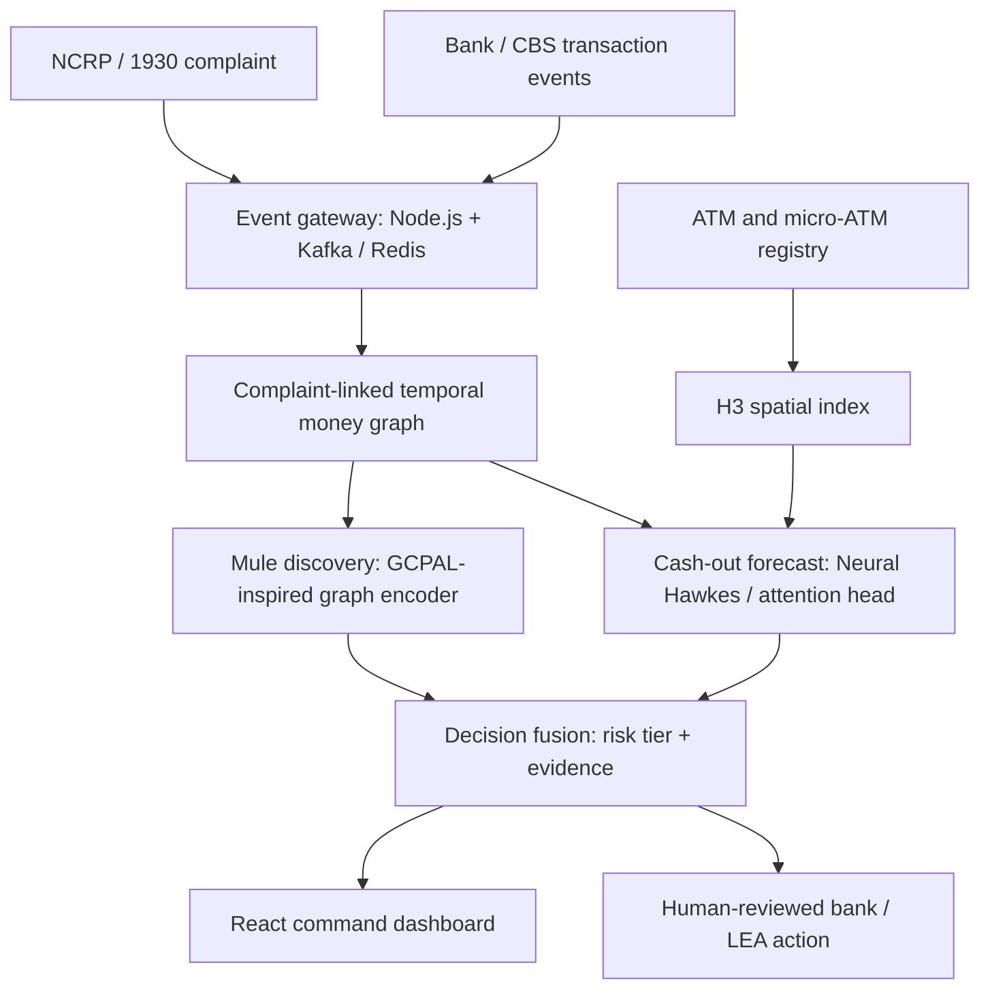

# PRAHARI

## Predictive Intelligence Engine for Cyber-Fraud Cash-Out Interception

**Smart India Hackathon 2026**  
**Problem Statement ID:** 26184  
**Category:** Software / Hardware — as shown in the current deck  
**Status:** Proposal and prototype blueprint

> **One-line pitch:** PRAHARI converts a cyber-fraud complaint into a live, explainable prediction of *which money-mule path is active, where the cash-out is likely to happen, and when intervention is most valuable*.

The current presentation leaves the official problem-statement title, theme, team ID, and team name blank. Those fields should be filled from the SIH portal before the final submission.

---

## 1. Executive Summary

Cyber-fraud response is time-sensitive. A victim may report a transaction through the National Cybercrime Reporting Portal (NCRP) or the 1930 helpline, but the stolen money can already be moving through several intermediary accounts. The final cash-out may happen through an ATM, micro-ATM, or another assisted banking point before an investigator has a complete picture of the route.

PRAHARI is designed as a decision-support layer around this workflow. It will:

1. accept a complaint and related transaction events;
2. construct a time-aware, multi-relational graph of accounts, transfers, identifiers, banks, and cash-out points;
3. identify suspicious intermediary nodes, including previously unseen mule behaviour;
4. estimate the probability and timing of the next cash-out event;
5. convert the forecast into an H3 geospatial cell containing a likely ATM or micro-ATM cluster; and
6. send a risk-tiered, explainable alert to the bank and law-enforcement workflow for human-approved action.

The proposal is not a claim that one new algorithm solves cyber fraud. Its value is the operational integration of several research-backed components into one complaint-linked loop: **graph tracing + continuous-time forecasting + privacy-preserving collaboration + precise geospatial action + human review**.

---

## 2. The Problem Statement in Simple Terms

### What happens after an online financial fraud?

Consider this simplified path:

```text
Victim account
      |
      | stolen payment
      v
Layer-1 mule account
      |
      | split transfer
      v
Layer-2 / Layer-3 mule accounts
      |
      | cash-out instruction
      v
ATM / micro-ATM / assisted banking point
```

The fraudster does not always withdraw money directly from the first receiving account. The money may be divided across several accounts within minutes. Each additional hop makes the trail harder to follow, especially when the receiving accounts are newly activated, have little history, or belong to different banks.

### Why this creates a response gap

The existing reporting and mitigation ecosystem is important: I4C describes NCRP/1930 reporting and the CFCFRMS workflow for sharing verified complaints with banks, tracing and freezing funds, sending alerts, tracking mule accounts, and supporting law-enforcement investigations. PRAHARI is proposed as an intelligence and prediction layer that can make that response more proactive.

The operational gap is:

- **A complaint is an event, not yet an explanation.** The response team needs the path of the money, not just the complaint number.
- **The graph changes continuously.** New accounts and transfers appear after the complaint is filed.
- **A blacklist is insufficient.** A fresh mule account may have no prior label.
- **A risk score alone is not actionable.** Investigators need a likely location, time window, evidence, and recommended next step.
- **Cross-bank data cannot simply be pooled.** The system must respect bank data boundaries and access controls.
- **False positives have consequences.** A model should support authorised human decisions, not automatically label a citizen or freeze an account solely because of a score.

### The “Golden Hour” framing

The deck uses the first 30 minutes as the **Golden Hour**. In PRAHARI, this should be presented as a product operating objective: every minute between complaint and possible cash-out matters. It is not an official universal recovery guarantee or a government SLA unless the SIH problem statement explicitly says so.

The system therefore focuses on reducing the time between:

```text
complaint received → suspicious path identified → likely cash-out forecast → authorised action
```

---

## 3. Proposed Solution: PRAHARI

### What PRAHARI will answer

For every active complaint, the engine should answer four practical questions:

1. **Which accounts or entities are connected to the reported transaction?**
2. **Which nodes look like active money-mule behaviour, even if they are not on a blacklist?**
3. **Which ATM or micro-ATM area is most likely to be used for cash-out?**
4. **What is the estimated time window and what risk-tiered action should be reviewed?**

### Main output: an actionable decision object

Instead of returning only `fraud_probability = 0.91`, PRAHARI should return a structured object similar to:

```json
{
  "incident_id": "INC-2026-00041",
  "risk_tier": "HIGH",
  "suspected_nodes": ["acct_hash_17", "acct_hash_31", "acct_hash_44"],
  "money_path": ["victim_hash", "acct_hash_17", "acct_hash_31", "acct_hash_44"],
  "probable_cashout_cells": [
    {
      "h3_cell": "8928308280fffff",
      "probability": 0.78,
      "nearby_cashout_points": 4
    }
  ],
  "cashout_window_minutes": {
    "lower_quantile": 15,
    "median": 27,
    "upper_quantile": 45
  },
  "evidence": [
    "rapid fan-out after complaint-linked receipt",
    "newly active intermediary account",
    "multi-hop path converging near cash-out points"
  ],
  "recommended_action": "analyst_review_and_bank_step_up",
  "model_version": "prahari-demo-0.1",
  "human_review_required": true
}
```

This output can be displayed on the command dashboard and passed to an authorised bank/LEA adapter. In the student prototype, the final action should be simulated and logged rather than connected to a live hold or lien rail.

---

## 4. End-to-End Workflow



### Step 1 — Complaint intake

The system receives a complaint identifier, incident time, reported amount, source account or payment identifier, bank/payment channel, and any available transaction reference.

For the prototype, this will be a mock NCRP/CFCFRMS adapter that accepts JSON events or replays prepared scenarios. A real NCRP, CBS, NPCI, or bank integration would require official authorisation, security review, and an approved interface.

### Step 2 — Live event ingestion

Transaction events are normalised into a common schema and placed on a stream. The prototype can use Kafka or Redis Streams, with a small event generator producing:

- normal transfers;
- complaint-linked transfers;
- fan-in and fan-out patterns;
- rapid multi-hop movement;
- ATM withdrawals;
- micro-ATM or merchant-assisted cash-outs; and
- delayed or missing events to test robustness.

### Step 3 — Build the time-aware money graph

The engine creates a heterogeneous graph in which nodes are entities and edges are timestamped relationships. The graph is not just a static list of accounts; the order and timing of events matter.

| Entity / relationship | Example representation | Why it matters |
|---|---|---|
| Account or wallet | pseudonymous account ID | receiving and forwarding funds |
| Victim / incident | complaint ID, source account hash | anchors the investigation |
| Bank or payment rail | bank code, channel type | supports routing and action context |
| Device / phone / identifier | salted or tokenised identifier | can reveal shared infrastructure where legally available |
| Merchant / micro-ATM / ATM | terminal ID and coordinates | links money movement to a physical cash-out point |
| Transfer edge | amount, timestamp, channel, status | captures the money trail |
| Withdrawal edge | amount, timestamp, terminal, location | identifies actual or likely cash-out |
| Shared-attribute edge | account ↔ phone/device/merchant | exposes relationships beyond direct transfers |

The production design should keep sensitive identifiers tokenised and access-controlled. The dashboard should show investigators the evidence they are authorised to see, not raw data by default.

### Step 4 — Identify mule behaviour

The graph model looks for combinations of signals rather than one suspicious rule:

- rapid receipt followed by forwarding;
- unusually high fan-in or fan-out;
- several hops within a short period;
- many new or recently active nodes connected to the incident;
- repeated convergence toward withdrawal points;
- behaviour that resembles known fraud subgraphs; and
- inconsistent behaviour across otherwise similar accounts.

The first implementation should include a transparent baseline score so the team can explain the system even before the graph neural network is complete. A learned model can then add representation learning and ranking.

### Step 5 — Forecast the next cash-out

The forecast head receives the recent event history and the graph representation. It estimates a continuous-time intensity:

```text
λ(cell, event type, t | recent transaction history, graph context)
```

In plain language, this is the changing likelihood that a cash-out event will occur at a particular place and time. A recent transfer can temporarily increase the predicted intensity; the effect can decay as time passes or change when new events arrive.

The output should include:

- ranked candidate ATM / micro-ATM cells;
- a median expected time to cash-out;
- lower and upper quantiles for an interval such as 15–45 minutes;
- confidence or uncertainty; and
- the evidence that caused the prediction to change.

### Step 6 — Convert coordinates into an actionable area

ATM and micro-ATM coordinates are mapped to H3 cells. H3 provides hierarchical hexagonal spatial indexes and makes it easy to aggregate points, compare neighbouring cells, and render a heatmap on the dashboard.

The PPT describes this as an approximately 100 m actionable cell. That label should be handled carefully: official H3 statistics report average edge lengths of roughly **531 m at resolution 8** and **201 m at resolution 9**, with geographic variation. The final deck should call the result a **fine-grained H3 cell or ATM cluster**, and the implementation should select the resolution based on the desired operational area.

### Step 7 — Trigger a tiered, human-reviewed response

Suggested prototype tiers:

| Tier | Meaning | Prototype response |
|---|---|---|
| Green | weak or incomplete evidence | continue monitoring |
| Amber | suspicious path or moderate forecast | create analyst review task |
| Red | strong graph evidence plus near-term cash-out forecast | send bank/LEA alert and simulate step-up / hold request |
| Critical | active withdrawal signal or high-confidence imminent cash-out | escalate immediately, subject to authorised policy |

The system should never silently perform an irreversible action. Every alert needs an explanation, model version, timestamp, reviewer decision, and audit entry.

---

## 5. Model Design in Practical Terms

### 5.1 Heterogeneous temporal graph encoder

The graph contains multiple node and edge types, and every transaction has a timestamp. A lightweight implementation can begin with temporal neighbor sampling plus a GraphSAGE/GAT/TGN-style encoder. A more ambitious version can use an HTGT-style transformer for relation-aware temporal attention.

The encoder produces an embedding for each active node and incident-linked subgraph. The embedding should capture:

- local transfer structure;
- multi-hop relationships;
- event recency;
- relation type;
- transaction velocity; and
- changes in behaviour after the complaint.

### 5.2 GCPAL-inspired mule discovery

The deck calls this module **GCPAL**. GCPAL is also the name of a 2024 graph contrastive pre-training framework for anti-money laundering. Its core idea is useful for this problem: learn from mostly unlabeled transaction graphs by creating multiple graph views and making the encoder learn stable representations across them.

For PRAHARI:

1. create two perturbed views of the complaint-linked graph by controlled edge or feature masking;
2. create a similarity-based view for nodes with comparable behaviour;
3. pre-train the graph encoder without requiring every node to have a fraud label;
4. fine-tune with confirmed or synthetic labels; and
5. combine the learned representation with explicit velocity and path features.

The team should describe this as **GCPAL-inspired pre-training or an adaptation of GCPAL**, not as an algorithm invented by PRAHARI.

### 5.3 Continuous-time cash-out prediction

The PPT names **GAttNHP**. A 2026 preprint uses the same name for a Group Attention Neural Hawkes Process that combines attention over event histories, group-level excitation, and a non-crossing quantile head. The conceptual fit is strong, but the paper is not specifically a cyber-fraud system.

For the prototype, implement the idea in increasing levels of complexity:

- **Baseline:** time-to-withdrawal classifier or survival model;
- **Intermediate:** multivariate Hawkes process over transfer, fan-out, and withdrawal events;
- **Advanced:** attention-based neural Hawkes head conditioned on graph embeddings.

This staged approach gives the team a working demo even if the full research model needs more training time.

### 5.4 Non-crossing quantile regression

Instead of predicting only one number such as “cash-out in 27 minutes,” the model predicts ordered quantiles:

```text
q10(time) ≤ q50(time) ≤ q90(time)
```

The interval is more useful operationally because it communicates uncertainty. The non-crossing constraint prevents an invalid result such as a 90th-percentile time that is earlier than the median.

The initial demo can use quantile loss with an explicit monotonicity penalty. A production version should validate calibration on held-out, time-ordered data.

### 5.5 Decision fusion

PRAHARI combines several signals:

```text
final risk = calibrated graph risk
           + cash-out intensity
           + recency / velocity signals
           + spatial concentration
           + uncertainty and policy thresholds
```

The exact weights should be learned or calibrated from validation data. For the demo, a transparent weighted score is acceptable if every component is shown on the dashboard and the weights are documented.

---

## 6. What We Are Going to Build

### Minimum viable prototype

The SIH prototype should prove the complete loop with synthetic or authorised anonymised data:

1. **Scenario generator** — produces normal and fraud-like transaction streams with known ground truth.
2. **Complaint intake API** — creates an incident and starts its response clock.
3. **Event gateway** — receives replayed NCRP, bank, ATM, and micro-ATM events.
4. **Live graph view** — displays the complaint-linked path and newly appearing hops.
5. **Mule-risk engine** — combines explainable rules with a graph model or graph embedding.
6. **Forecast service** — predicts candidate cash-out cells and a time interval.
7. **H3 map** — renders the ranked cell, nearby cash-out points, and confidence.
8. **Alert service** — creates Green/Amber/Red/Critical alerts with explanations.
9. **Human-review workflow** — lets an analyst acknowledge, escalate, dismiss, or request more evidence.
10. **Audit log** — records inputs, model version, prediction, reviewer decision, and simulated action.
11. **Federated-learning demonstration** — runs two or three simulated bank clients without merging their raw local transaction tables.
12. **Evaluation panel** — shows alert latency, precision@K, interval coverage, false positives, and simulated recovery outcomes.

### Demonstration scenario

The strongest demo should be a replayable story:

1. At `10:00`, a citizen files a complaint through the simulated NCRP adapter.
2. At `10:01`, the stolen amount reaches a Layer-1 account.
3. At `10:03`, the amount splits across Layer-2 accounts.
4. At `10:06`, one new node forwards money toward a cluster of cash-out points.
5. PRAHARI updates the graph, ranks the node, and raises the cash-out intensity for the corresponding H3 cell.
6. The dashboard shows a forecast such as `q10 = 15 min`, `median = 27 min`, `q90 = 45 min`.
7. An analyst sees the path, evidence, and risk tier, then approves a simulated bank/LEA escalation.
8. The scenario produces either a blocked withdrawal or a recorded miss, allowing the metrics to be calculated.

This is more convincing than showing a static “fraud probability” because it demonstrates the entire decision cycle.

### Recommended API surface

```text
POST /api/incidents
POST /api/events/transactions
POST /api/events/withdrawals
GET  /api/incidents/:id/graph
GET  /api/incidents/:id/forecast
GET  /api/incidents/:id/alerts
POST /api/alerts/:id/acknowledge
POST /api/alerts/:id/escalate
POST /api/actions/simulate
GET  /api/metrics
```

### Recommended repository structure

```text
prahari/
├── frontend/              # React dashboard and H3 map
├── gateway/               # Node.js API, auth, WebSocket/SSE updates
├── stream-simulator/      # synthetic NCRP/bank/ATM event producer
├── ml-service/             # FastAPI inference endpoints
│   ├── graph/              # graph construction and feature extraction
│   ├── mule_detection/     # baseline, GCPAL-inspired encoder
│   ├── forecasting/        # Hawkes / quantile models
│   └── calibration/        # thresholds and evaluation
├── data/                   # schema and small synthetic fixtures
├── infra/                  # Docker Compose and service configuration
└── docs/                   # model cards, threat model, API contract
```

---

## 7. Why PRAHARI Is Unique

The individual building blocks are established research or engineering techniques. PRAHARI’s differentiator is how they are joined to answer an operational question immediately after a complaint.

| Typical capability | Limitation when used alone | PRAHARI’s combination |
|---|---|---|
| Rule-based account screening | catches known patterns but misses new behaviour | graph representation plus self-supervised learning |
| Static fraud classifier | scores a transaction but ignores the evolving path | live temporal graph updated as new events arrive |
| Blacklist / suspect registry | cannot identify a newly activated mule before a label exists | GCPAL-inspired learning from mostly unlabeled structure |
| Historical hotspot map | shows where withdrawals happened previously | continuous-time forecast of the next likely cash-out |
| A point prediction | hides uncertainty and can be badly calibrated | ordered quantiles and an explicit time window |
| A city-wide alert | creates unnecessary friction and poor police utilisation | H3 cell and ranked ATM/micro-ATM cluster |
| Centralised cross-bank training | conflicts with raw-ledger privacy requirements | federated learning with protected model updates |
| Automatic blocking | risks false positives and weak accountability | tiered, explainable, human-reviewed action |

### The core differentiator

PRAHARI does not stop at **“this account looks suspicious.”** It attempts to produce:

```text
reported incident
→ active multi-hop money path
→ likely next cash-out event
→ likely H3 location
→ estimated time window
→ evidence-backed, human-reviewed action
```

That closed loop is the proposal’s strongest uniqueness claim.

### How to describe novelty honestly

Use:

> “PRAHARI proposes a complaint-triggered, privacy-preserving decision-support pipeline that combines temporal graph reasoning, self-supervised mule discovery, continuous-time cash-out forecasting, and H3-level operational alerts.”

Avoid:

> “We invented GCPAL, Neural Hawkes processes, federated learning, or H3.”

The research contribution, if the team later publishes it, would be the adaptation, fusion, calibration, and evaluation of these components for post-complaint cyber-fraud cash-out interception.

---

## 8. Technology Stack

| Layer | Technology | Role in PRAHARI |
|---|---|---|
| Dashboard | React | incident queue, money graph, forecast panel, map, evidence, action log |
| Gateway / orchestration | Node.js with Express or NestJS | APIs, authentication, alert routing, WebSocket/SSE updates |
| ML API | Python with FastAPI | model inference, training utilities, evaluation endpoints |
| Deep learning | PyTorch | graph encoder, temporal model, quantile head |
| Graph learning | PyTorch Geometric or DGL | message passing, temporal sampling, graph experiments |
| Event streaming | Apache Kafka | durable event stream and replayable processing |
| Low-latency state | Redis / Redis Streams | incident clock, recent event state, alert cache |
| Relational storage | PostgreSQL | incidents, metadata, audit trail, metrics, model versions |
| Spatial indexing | Uber H3 with Python and JavaScript bindings | cell assignment, neighbourhood aggregation, map rendering |
| Map rendering | MapLibre GL JS or Leaflet | visualise cells, ATM clusters, and routes |
| Federated-learning demo | Flower or a lightweight custom FedAvg simulator | simulate multiple bank clients without centralising raw tables |
| Security | HTTPS/mTLS, JWT/RBAC, signed updates, encryption at rest | protect APIs and separate analyst/bank/administrator roles |
| Deployment | Docker Compose for prototype | reproducible local demo with gateway, ML service, stream, database, and Redis |

### Resolve the database inconsistency in the current PPT

The slide’s technology icons show **MySQL**, while the methodology text says **PostgreSQL audit store**. Select one before finalising the deck. PostgreSQL is the better single choice for this blueprint because it matches the methodology text and can also support JSON, indexing, and audit-oriented schemas. MySQL can be used if the team already has a stronger implementation base, but the presentation should not show both without an explanation.

### Prototype versus production technology

The prototype can use a single machine and synthetic streams. A production deployment would need high-availability streaming, bank-side connectors, key management, network segmentation, observability, incident response, formal access approvals, and security testing. The prototype should demonstrate the architecture without implying that it is already connected to live government or banking infrastructure.

---

## 9. Research and Technical Foundation

### Core references from the current PPT

| Reference | What it contributes to PRAHARI |
|---|---|
| [The Neural Hawkes Process — Mei & Eisner, NeurIPS 2017](https://proceedings.neurips.cc/paper/2017/hash/6463c88460bd63bbe256e495c63aa40b-Abstract.html) | Models event intensity in continuous time; supports forecasting what event may happen next and when. |
| [Self-Exciting Point Process Modeling of Crime — Mohler et al., JASA 2011](https://doi.org/10.1198/jasa.2011.ap09546) | Shows how self-exciting point processes can model spatio-temporal clustering and forecast crime pressure. PRAHARI adapts the intuition to cash-out events. |
| [Communication-Efficient Learning of Deep Networks from Decentralized Data — McMahan et al., AISTATS 2017](https://proceedings.mlr.press/v54/mcmahan17a.html) | Introduces the practical Federated Learning formulation used as the privacy-preserving collaboration foundation. |
| [H3 Documentation and Cell Statistics](https://h3geo.org/docs/) | Provides hierarchical hexagonal indexing, neighbourhood operations, and resolution statistics for turning coordinates into operational cells. |

### Additional references that strengthen the proposal

| Area | Reference | How we use it |
|---|---|---|
| Label-scarce AML | [Graph Contrastive Pre-training for Anti-money Laundering — Lu & Wang, 2024](https://link.springer.com/article/10.1007/s44196-024-00720-4) | Directly motivates GCPAL-style self-supervised pre-training on unlabeled transaction graphs before supervised fine-tuning. |
| Dynamic graphs | [Temporal Graph Networks for Deep Learning on Dynamic Graphs — Rossi et al., 2020](https://arxiv.org/abs/2006.10637) | Supports event-based graph memory and temporal message passing for graphs that evolve continuously. |
| Camouflaged fraud | [Enhancing Graph Neural Network-based Fraud Detectors against Camouflaged Fraudsters — Dou et al., CIKM 2020](https://arxiv.org/abs/2008.08692) | Motivates relation-aware neighbour selection and robustness when fraudsters resemble normal users. The authors’ [implementation](https://github.com/YingtongDou/CARE-GNN) is useful for experiments. |
| Heterogeneous temporal attention | [Heterogeneous Temporal Graph Transformer — Fan et al., KDD 2021](https://dl.acm.org/doi/10.1145/3447548.3467168) | Provides a research basis for combining relation types and temporal information with transformer-style attention. |
| Grouped event forecasting | [GAttNHP: Group Attention Neural Hawkes Process — Tian et al., 2026 preprint](https://arxiv.org/abs/2607.14733) | Closely matches the proposed attention + Hawkes + group interaction + non-crossing quantile design. It is a general temporal-knowledge-graph paper, not a cyber-fraud validation. |
| Non-crossing intervals | [Deep Non-crossing Quantiles through the Partial Derivative — Brando et al., AISTATS 2022](https://proceedings.mlr.press/v151/brando22a.html) | Supports monotonically ordered quantile outputs so lower, median, and upper time estimates remain valid. |
| Non-crossing quantile processes | [Nonparametric Estimation of Non-Crossing Quantile Regression Process with Deep ReQU Neural Networks — Shen et al., JMLR 2024](https://jmlr.org/papers/v25/22-0488.html) | Provides a more formal statistical basis for penalised non-crossing quantile estimation. |
| Secure aggregation | [Practical Secure Aggregation for Privacy-Preserving Machine Learning — Bonawitz et al., CCS 2017](https://dl.acm.org/doi/10.1145/3133956.3133982) | Explains how a coordinator can aggregate updates without seeing each institution’s individual update. |
| Explainability | [GNNExplainer — Ying et al., NeurIPS 2019](https://arxiv.org/abs/1903.03894) | Provides a direction for showing which nodes, edges, and features influenced a graph prediction. |
| Indian operating context | [I4C: National Cybercrime Reporting Portal](https://i4c.mha.gov.in/ncrp.aspx) and [I4C Major Initiatives](https://i4c.mha.gov.in/initiative.aspx) | Grounds the proposed NCRP/1930, CFCFRMS, I4C, bank, and LEA workflow in the existing public ecosystem. |

### Research gap / PRAHARI contribution

These references solve different parts of the problem:

- GCPAL addresses label scarcity but does not by itself forecast a physical cash-out point.
- Temporal GNNs represent evolving relationships but do not automatically produce a bank/LEA action.
- Hawkes models forecast event intensity but need graph and spatial context for this use case.
- Federated Learning protects data boundaries but does not create the fraud-detection logic by itself.
- H3 turns locations into comparable cells but is an indexing system, not a risk model.

PRAHARI’s proposed contribution is a single incident-driven loop that connects all of these outputs and evaluates them against operational metrics.

---

## 10. Data, Labels, and Training Strategy

### Data available for the prototype

Because real NCRP, bank, CBS, and NPCI data is sensitive and access-controlled, the prototype should use:

- a synthetic transaction generator with known fraud paths;
- public graph or fraud datasets only where their license and schema are appropriate;
- anonymised or institutionally approved sample data if the team receives it; and
- a synthetic ATM/micro-ATM registry with coordinates.

The dashboard should clearly label synthetic events as **simulation**.

### Label strategy

Use three types of supervision:

1. **Strong labels:** confirmed synthetic fraud paths or authorised historical cases.
2. **Weak labels:** rule-derived signals such as rapid fan-out, newly active nodes, and known withdrawal outcomes.
3. **Unlabelled data:** ordinary graph events used for contrastive pre-training and anomaly modelling.

### Avoid data leakage

The training and evaluation split must be time-ordered. When predicting at time `t`, the model must not receive events that occurred after `t`. Features such as “eventually withdrawn” are valid labels or post-event analysis fields, not input features available at forecast time.

### Federated-learning experiment

Create two or three simulated bank clients:

```text
Bank A local data ─┐
Bank B local data ─┼─> protected update aggregation ─> shared model
Bank C local data ─┘
```

The experiment should demonstrate that raw transaction rows remain in each client process. The coordinator receives model updates or aggregated statistics, not the raw local ledger. For a real deployment, the threat model, secure aggregation, differential privacy, membership-inference risk, and model-poisoning risk need formal review.

---

## 11. Evaluation Plan

The current PPT already identifies four important validation targets: **alert latency, precision@K, recovery rate, and false positives**. Add the following definitions so the evaluation is measurable.

| Metric | Definition for the prototype |
|---|---|
| Alert latency | time from complaint/event ingestion to first actionable alert |
| Precision@K — nodes | proportion of the top K ranked accounts that belong to the known simulated fraud path |
| Precision@K — cells | proportion of the top K cells containing the actual cash-out point |
| Time-window coverage | percentage of true cash-outs falling inside the predicted interval |
| Median time error | absolute difference between predicted median and actual cash-out time |
| False-positive rate | proportion of normal incidents escalated to a high-risk tier |
| Recall / PR-AUC | useful for highly imbalanced fraud classification |
| Simulated recovery rate | fraction of stolen amount blocked before simulated withdrawal |
| Analyst workload | number of alerts requiring review per incident batch |
| System p95 latency | 95th-percentile processing time for graph update and forecast |
| Drift response | change in performance after the fraud pattern is modified |

Do not present target numbers as achieved results until they are measured. The deck should distinguish clearly between:

- **design targets**;
- **pilot measurements**; and
- **production outcomes**, which cannot be claimed without real deployment data.

### Baselines to compare against

At minimum, compare:

1. static rules only;
2. tabular model without graph features;
3. graph model without temporal forecasting;
4. graph + point estimate without quantiles; and
5. full PRAHARI pipeline.

This ablation study will show whether each proposed component adds value.

---

## 12. Feasibility, Risks, and Mitigations

| Challenge | Why it matters | Mitigation |
|---|---|---|
| No direct live NCRP/bank access | the team cannot safely claim production integration | build adapters and replay synthetic or authorised anonymised events |
| Label scarcity | new mule nodes are not on a blacklist | GCPAL-inspired self-supervised pre-training, weak labels, and analyst feedback |
| Cross-bank data boundary | raw ledgers cannot be centrally pooled | federated training; secure aggregation and differential privacy in the production roadmap |
| National-scale graph cost | scoring every account continuously is expensive | complaint-linked subgraphs, temporal sampling, caching, and event-driven updates |
| False positives | an incorrect alert can create financial and social harm | calibrated tiers, evidence display, human approval, reversible simulated actions |
| Fraudster adaptation | patterns change after rules are deployed | drift monitoring, feedback labels, scheduled recalibration, red-team scenarios |
| Heavy-tailed time-to-cash-out | a mean estimate can be misleading | quantile prediction and interval-coverage evaluation |
| Missing or delayed events | a forecast may be based on incomplete information | data-quality flags, uncertainty increase, backfill/replay, fail-safe monitoring |
| Model poisoning or update leakage | federated updates can still be attacked or analysed | signed updates, secure aggregation, DP where appropriate, client validation, audit logs |
| H3 resolution mismatch | a cell may be too broad or too narrow for the use case | make resolution configurable and report the actual cell statistics |
| Security and compliance | financial and identity data is high impact | pseudonymisation, RBAC, encryption, retention policy, explicit approvals, auditability |

### The role of human review

Human-in-the-loop is not an optional UI feature. It is part of the safety design:

- the model explains the path and evidence;
- the analyst verifies whether the path is plausible;
- the bank or LEA applies its own policy and authority;
- the system records the decision and outcome; and
- later feedback improves calibration and drift monitoring.

---

## 13. Privacy, Security, and Legal Boundaries

PRAHARI should be positioned as an authorised decision-support system, not as an autonomous surveillance or account-blocking tool.

### Prototype safeguards

- use synthetic or tokenised identifiers;
- keep personal data out of screenshots and demo logs;
- implement role-based access for analyst, bank, LEA, and administrator views;
- encrypt API traffic and secrets;
- store an immutable-style audit trail for predictions and actions;
- show model version and evidence for every alert; and
- simulate, rather than execute, any irreversible financial action.

### Production roadmap safeguards

- bank-side data processing and federated model training;
- secure aggregation of updates;
- differential privacy based on a measured privacy budget;
- signed model and feature updates;
- key management and certificate rotation;
- retention and deletion policies;
- model-card and risk-impact documentation; and
- independent security, privacy, and compliance review.

SMPC, homomorphic encryption, and differential privacy should be presented as a production privacy roadmap, not as three fully implemented guarantees in the hackathon prototype unless the team can demonstrate and benchmark them.

---

## 14. Feasibility and Viability Summary

### Technical

The required pieces are mature enough for a prototype: React, Node.js, FastAPI, PyTorch, Kafka/Redis, relational storage, graph learning libraries, and H3. The research risk is concentrated in model integration and calibration rather than basic software availability.

### Economic

A complaint-linked 2–3 bank simulation controls compute and data requirements. The design reuses existing reporting, banking, and LEA decision rails conceptually rather than requiring new ATM hardware.

### Operational

The primary output is compact and actionable: a risk tier, money path, H3 cell, time window, evidence, and audit record. This makes it easier to integrate into an analyst workflow than a raw model score.

### Social

Earlier, more targeted response can improve the opportunity to stop or recover funds while avoiding indiscriminate city-wide ATM restrictions. The human-review boundary is essential to prevent unjustified automated action.

### Scale

The complaint-linked graph keeps the first response focused. Federated learning provides a route for adding more banks later without requiring a central raw ledger, subject to real governance and security approvals.

---

## 15. Suggested Final Presentation Narrative

Use this sequence when converting the brief back into slides or a pitch:

1. **The money moves before the response catches up.**
2. **PRAHARI starts from the complaint and reconstructs the live path.**
3. **Graph AI finds hidden mule behaviour, including new nodes.**
4. **Continuous-time forecasting predicts the next cash-out window.**
5. **H3 converts the prediction into a precise ATM/micro-ATM area.**
6. **Privacy-preserving learning lets banks improve together.**
7. **Human-reviewed tiers turn predictions into accountable action.**
8. **The prototype proves the loop on replayable synthetic scenarios.**

### Strong closing line

> “PRAHARI does not wait for the withdrawal to become evidence. It turns the first complaint into a live prediction of the next cash-out opportunity—where it may happen, when it may happen, and why the response team should act.”

---

## 16. Decisions to Finalise Before Submission

- Fill in the official SIH problem-statement title and theme.
- Add the registered team ID and team name.
- Standardise the database choice: PostgreSQL or MySQL.
- Decide whether the first demo uses a TGN/GAT baseline, an HTGT-style encoder, or both as an ablation.
- Decide whether GAttNHP is implemented as a full model or described as an advanced roadmap with a simpler Hawkes/quantile baseline in the prototype.
- Choose and document the H3 resolution; avoid calling resolution 8/9 exactly “100 m” without qualification.
- Label all synthetic data and simulated bank/LEA actions clearly.
- Report measured results only after running time-ordered evaluation and ablation experiments.

---

## References and Official Context

- [National Cybercrime Reporting Portal — I4C](https://i4c.mha.gov.in/ncrp.aspx)
- [I4C Major Initiatives: CFMC and CFCFRMS](https://i4c.mha.gov.in/initiative.aspx)
- [National Cyber Crime Reporting Portal](https://www.cybercrime.gov.in/)
- [Neural Hawkes Process — NeurIPS 2017](https://proceedings.neurips.cc/paper/2017/hash/6463c88460bd63bbe256e495c63aa40b-Abstract.html)
- [Self-Exciting Point Process Modeling of Crime — JASA 2011](https://doi.org/10.1198/jasa.2011.ap09546)
- [Federated Learning — AISTATS 2017](https://proceedings.mlr.press/v54/mcmahan17a.html)
- [GCPAL — Graph Contrastive Pre-training for Anti-money Laundering](https://link.springer.com/article/10.1007/s44196-024-00720-4)
- [Temporal Graph Networks](https://arxiv.org/abs/2006.10637)
- [CARE-GNN](https://arxiv.org/abs/2008.08692)
- [Heterogeneous Temporal Graph Transformer](https://dl.acm.org/doi/10.1145/3447548.3467168)
- [GAttNHP preprint](https://arxiv.org/abs/2607.14733)
- [Deep Non-crossing Quantiles](https://proceedings.mlr.press/v151/brando22a.html)
- [Non-Crossing Quantile Regression Process — JMLR 2024](https://jmlr.org/papers/v25/22-0488.html)
- [Practical Secure Aggregation](https://dl.acm.org/doi/10.1145/3133956.3133982)
- [H3 Documentation](https://h3geo.org/docs/)
- [H3 Cell Statistics](https://h3geo.org/docs/core-library/restable/)
- [GNNExplainer](https://arxiv.org/abs/1903.03894)

*Prepared from the content and terminology in `PRAHARI_SIH2026.pptx`, with research and official-context links added for technical grounding.*
